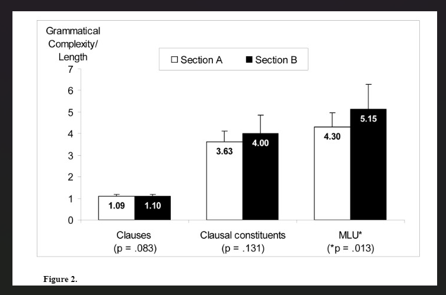
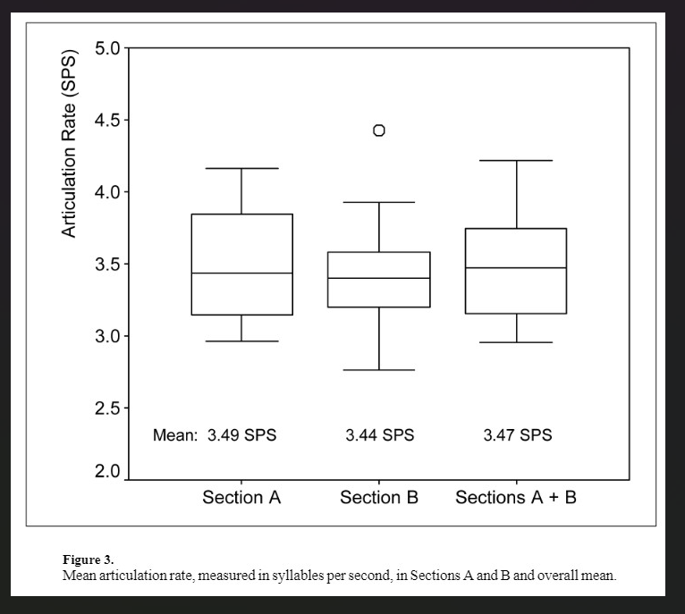
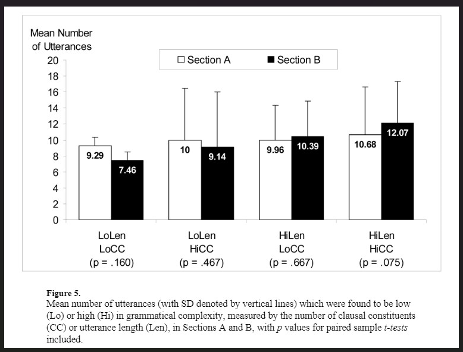
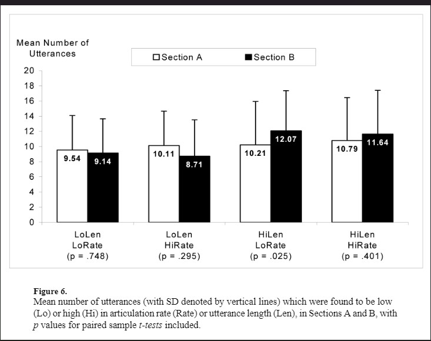

文献：Sawyer, J., Chon, H., & Ambrose, N. G. (2008). Influences of rate, length, and complexity on speech disfluency in a single-speech sample in preschool children who stutter. _Journal of Fluency Disorders_, _33_(3), 220–240. https://doi.org/10.1016/j.jfludis.2008.06.003
[论文原文](../Source_Files/2023-01-17-HLM.pdf)
## 介绍
口吃显著的特点是多变性，影响口吃变异性的因素一直是研究关注的对象，语速，语法复杂性和话语长度是重要的三个参数。语法复杂性、语速和话语长度可能在口吃的多变性中发挥作用。 目前尚不清楚的是，一个参数是否比另一个参数对变异性的影响更大，以及这三个参数在个体儿童的变异性中可能发挥的作用。
研究现状：
虽然已发现长度和复杂性会影响流畅性，但影响程度尚不清楚。各研究结果差异较大：有研究显示长度和语法复杂性对不流畅的影响因人而异；一些研究发现语法复杂性比长度的影响更大；但也有其他研究发现，长度对流畅性的影响大于语法复杂性。关于语速对不流畅影响的研究尚无定论，部分原因在于所比较的内容不同，不同研究的测量方法和使用的度量标准也可能会导致各种研究结果的一些差异。通过比较口吃儿童和正常流利儿童的语速，一些研究发现口吃儿童和他们正常流利的同龄人在语速上没有显著差异，但也有研究者发现了差异，可能归因于口吃的严重程度，另有研究者发现当语音被分割成音调单元时，语速对不流畅有影响。
迄今为止，很少有研究关注语速、长度和复杂性对言语不流畅的综合影响。
## 本研究
目的是确定速度，话语长度和语法复杂性对口吃样不流利（SLD）的影响：1，这些因素是否能在较长的语音样本（音节901–1200）结束时，造成的不流利程度明显大于开始时（音节1–300）。2，探索这些孩子在这两个部分的语音中，速度，长度和语法复杂性之间的相互作用。

## 方法：
根据要求本研究选取了14名被试，使用加权测量评估严重程度，其中有6名儿童出现轻度口吃，7例中度口吃，1例严重口吃。每个样本的长度至少为 1200 个音节，在孩子玩Play-Doh并与父母和临床医生互动时引出该样本。选择每个语音样本的前 300 （A部分）和后 300 个音节（B部分）进行分析。选择话语的平均长度而不是音节数作为长度的度量，通过计算每个话语的从句成分的数量来衡量语法复杂性。语速被定义为每个话语中感知流畅的音节数除以话语的持续时间（以秒为单位），去除所有口吃的情况，如SLD，并在专业的语音实验室对受试者的话语进行捕捉分析。

实验分析了A部分和B部分中每个话语的从句数量、从句成分和以语素衡量的平均话语长度的平均差异：A节和B节中每个话语的平均从句数非常相似，无显著差异；B部分的从句成分有增加的趋势，但与A的差异并不显著；B部分的平均话语长度显示出相似的增长模式。且与A的差异显著。对MLU进行进一步分析发现：10名儿童在其年龄的预期MLU方面高于平均值，11名儿童在B部分的整个样本中都超过了MLU。群体调查还显示，儿童在B部分中的整个语音样本中都倾向于超过他们的MLU，而在A部分中倾向于低于他们的MLU。此外，A部分的语速相对而言比B部分的更为多变，但两个部分的语速没有显著差异。如图1，图2

为了确定两个语音样本中的语速、话语长度和语法复杂度之间的相互作用，使用中值分割程序将三个参数中的每一个参数的话语分类为“高”或“低”。使用“高”和“低”标准对三种不同的对比进行了比较：复杂性（语法复杂性是根据从句成分的数量来衡量）和语速、复杂性和长度（以语素衡量）以及长度和语速，使用配对t检验分析配对对比。在本实验中，高长度/低速率和高长度/高复杂性的话语在 B 部分中出现的频率更高；A 部分有更多的低长度/低速率、低长度/高速率和低长度/低复杂性的话语。如图3，图4，图5

## 结果：
本研究发现在先前研究中影响不流利的因素与较长语音样本的结尾相关，儿童变得更加不流利。以语素衡量的平均话语长度在 B 部分更大，其 SLD 明显多于 A 部分。在本研究中，长度（由MLU测量）是两个语音部分中更重要的差异，而非语法复杂性。长度是“宏观变量”，包含语法复杂性、语言学、音系和韵律规划；长度和复杂性之间的关系仍不清楚，且很难区分长度和复杂性的影响；本研究的结果并不支持语速影响 SLD 的增加，B 部分的发音率比 A 部分相对更稳定，A 部分中语速的可变性可能是由于系统灵活性（协调动力学理论）。研究结果支持使用强调较短话语长度的治疗措施来建立流畅性。

其他理论对于本研究的解释：

1，本研究中关于长度的数据支持口吃的需求和能力 (DCM) 模型，根据 DCM，儿童具有一套特定的能力来产生流利的言语，并要求限制内部和/或外部的流利性。DCM 预测复杂性和长度都足以独立地与不流畅相关联，这有助于解释本研究中的数据。

2，Bosshardt 提出了一个与任务需求相关的模型，他们发现，口吃的成年人在注意力分散的双重任务条件下，要么会说出更短且语法复杂度较低的话语，要么会更加不流畅。这些调查表明，口吃者和说话通常流利的人在认知加工上存在差异。从这个角度来看B 部分中较长的话语比 A 部分中较短的话语需要更多的认知资源来产生，从而导致更多的不流畅。

3，隐蔽修复假说 (CRH)，即不流畅是说话者监控语音计划时发生的隐蔽修复的副产品，更长或更复杂的话语比更短、更简单的话语需要更多的监控。监控的增加可能导致较长话语的不流畅，这与本研究的结果一致。

## 局限：
本研究的语音样本被限制在 300 个音节以内，因此一些话语太短而无法分析语速和/或语法复杂性。未来的研究应考虑使用更长的语音样本，并且为了确定 MLU 和从句成分之间的关​​系，有必要进一步研究儿童在 B 部分添加了哪些元素。其次，本研究选取的被试数量较少，应考虑使用更多不同严重程度的儿童群体进行进一步研究。最后，有关语音样本本身的问题仍未得到解答。未来针对不同说话伙伴或主题的研究可能会提供更多关于较长语音样本中产生的不流畅的线索。此外，还可以进一步探讨样本大小和话语长度之间的关系。
这项研究的结果表明，在一段较长的语音样本结束时，似乎对儿童口吃不流畅影响最大的因素是较长的话语长度。但文中也提到长度是“宏观变量”，且很难与语法复杂性的影响区分开，但长度无疑是进一步研究的一个切入点。且本研究的样本量有限，对于结果应谨慎解释。本研究中所采用的对于语速、长度和复杂性的界定，未来如果开展相关研究可以以此为参考。并且，研究中所采用的成对对比分析的方法也值得借鉴，用来分析多因素的研究。