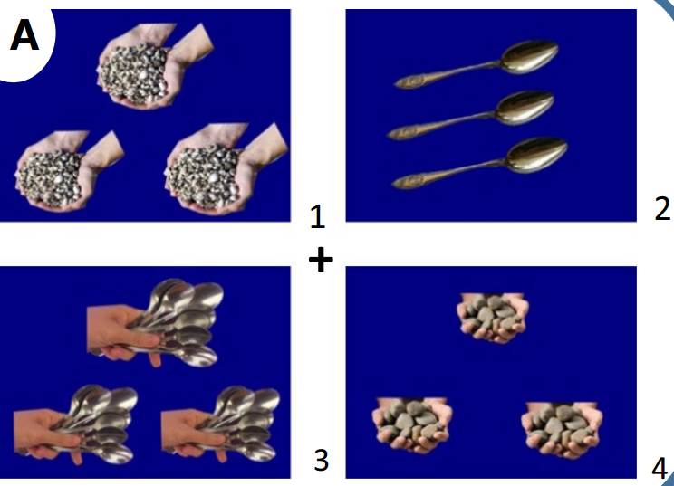
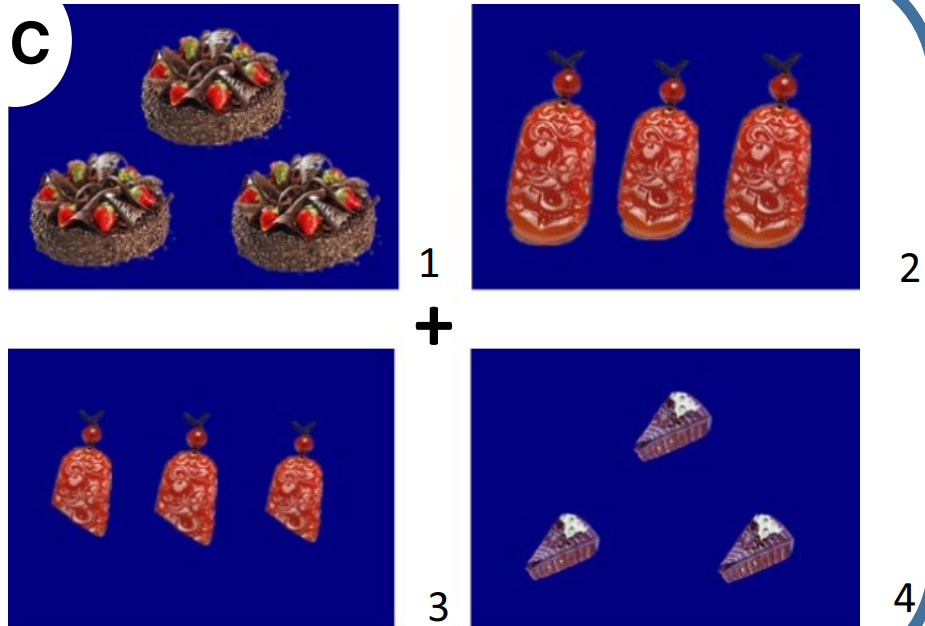
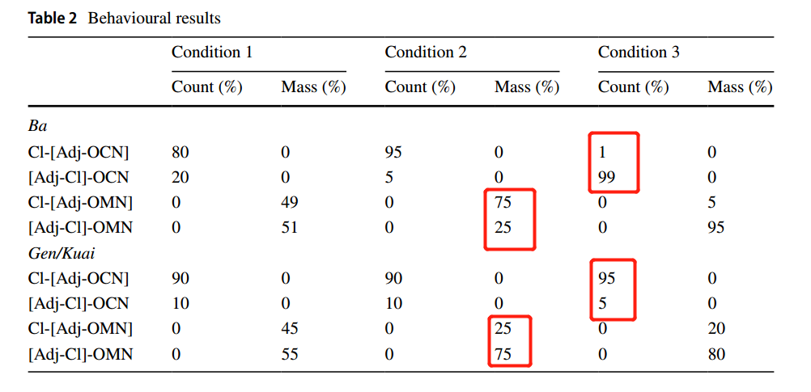

# 论文信息
Yao, P., Stockall, L., Hall, D. et al. Processing Evidence for the Grammatical Encoding of the Mass/Count Distinction in Mandarin Chinese. J Psycholinguist Res 51, 341–371 (2022). https://doi.org/10.1007/s10936-022-09844-0
# [论文原文](Source_Files/2023-5-28-YXY1.pdf)
# 关键词
汉语普通话；可数/不可数的区分；视觉情景范式；句法的预测；预期性眼动；词汇语义学
# 摘要 
该研究采用视觉情景范式（visual world paradigm），旨在探讨汉语普通话中名词可数/不可数的区分是否由句法（syntax）来决定。通过使用歧义量词（既可以表征可数量词含义，也可以表征不可数量词含义）、本身可数及不可数的名词、以及带有/不带有偏向句法线索的短语结构，作者发现，中文母语者对于可数名词与不可数名词的区分主要是通过短语的句法结构来判断的，但当句法与名词本身的含义冲突的情况下，句法的效应会被名词本义覆盖。结果表明，在汉语普通话中，句法线索可以在实时加工中快速地对即将到来的信息做出预测。
# 研究背景
## 1.1中英文中可数/不可数名词标记的区别
英语可以通过明显的单数或复数标记来判断一个名词是否可数（Pelletier, 2012），例如冠词（只有可数名词可以附上不定冠词，不可数名词不行）、复数词缀（可数名词与复数语素结合，直接与数词一起出现，而不可数名词不行）。  
与之相对，中文书写系统缺乏屈折标记（除了“们”，并没有语素可以用来标记复数形式）。词语在表征单数和复数时其字形形态并不发生变化。同时，在构成名词性短语时，数字与名词无法直接组合，需要搭配适当的量词。    

## 1.2学界不同的观点
先简单了介绍一下量词分类：
可数量词：simply name the unit that the entities naturally have，如一“只”猫；不可数量词：create a unit to measure substances and pluralities，如一“瓶”水（Cheng ＆ Sybesma，1998）；歧义量词，例如一“把”伞、一“把”沙子（Zhang，2012）。如何区分三者？ 只有不可数量词可以用这种结构[Num-Adj-Cl]，可数量词不行 

针对中文的特征，学界对于中文是否存在区分可数和不可数名词的语法标记存在争议：
* 有些学者认为中文可数与不可数名词的区分不像英语一样在语法上有标记 (Allan, 1980; Chierchia, 1994, 1998a, 1998b; Krifka, 1995; Li, 2013)

* 另一些学者认为中文的可数与不可数名词的区分标记在句法层面，它是在量词这一层面上实现的 (Borer, 2005; Cheng & Sybesma, 1998, 1999, 2012; Pelletier, 2012)

在第二种观点内部，仍然存在争议，具体来说可分为两类观点：
* 有些学者认为中文可数/不可数的区别是由名词的属性决定的，而不是量词的属性决定的 (Cheng, 2012; Cheng & Sybesma, 1998, 1999; Doetjes, 1997）他们认为名词基于它们的指称意义而在语义上被标记为可数或不可数。这种基于语义的可数和不可数的名词区分，在句法上通过量词系统反映出来。（词汇层面的标记）
* 而另一些学者认为中文的可数与不可数名词的区分标记在句法层面(Borer,2005;Pelletier,2012）他们认为中文名词在语义上是无标记/不明确的，可数和不可数是由句法结构（量词）决定的。（句法层面的标记）

## 1.3前人的研究及其不足 
一些前人的研究显示出中文母语者对于可数量词和不可数量词的不同功能十分敏感，例如母语者总是将可数量词与具有离散单位和清晰边界的物体相匹配，把不可数量词与没有特定单元的未成形物质相匹配等，但这些研究无法辨别以上两种观点（词汇层面和句法层面）哪一个是正确的。

也有研究发现，汉语中的单个名词可根据数量和体积来计数，基于数量计数的是可数名词，而基于体积计数的不可数名词 （Barner et al., 2009; Chien et al., 2003; Imai & Gentner, 1997; Imai & Mazuka, 2003, 2007; Lin & Schaefer, 2018）。这似乎支持了词汇层面这一观点，但也不能排除掉句法层面的观点，因为据Borer（2005）的观点来看，表达可数/不可数这一含义的句法结构可能十分隐蔽。因此也无法辨别哪个观点正确。

而最近，已有研究在探究独立出现的名词的可数性（countability）时发现，中文读者在加工独立出现的名词时，对大部分名词都可以做可数和不可数的理解，即某一个特定名词并非一定表征可数的义项或不可数的义项。这些研究认为这样的数据支持了中文的可数/不可数名词区分标记不是在词汇层面。因为如果是在词汇层面的话，某一个名词只能归属为可数或者不可数，不能表征两种义项。  

前人的研究虽然可以证否中文可数/不可数名词的区分标记在词汇层面这一派理论，但并不能证实中文的可数/不可数名词区分标记在句法层面。因为他们的研究只关注了独立出现的名词，并没有考虑到名词出现的句法环境。
针对这一空白，本研究考察了不同的句法结构对于中文母语者对于名词性短语的可数/不可数表征的影响，以此来探究中文可数/不可数名词的区别标记究竟是在词汇层面还是在句法层面。
# 研究方法
为研究这一问题，作者采用视觉情景范式（VWP）来探究汉语母语者对句法结构不同（中性/偏向不可数量词）的名词短语的即时加工和解释，以及探究本身可数名词（OCN）与本身不可数名词（OMN）之间的差异。VWP的优势在于：它不仅允许我们实时地跟踪短语是如何被解释的，而且还可以确定生成了哪些解释。
## 2.1材料
1. 材料中量词的选择：选用三个歧义量词：“根”，“块”，“把”，将三个歧义量词都嵌入到三个不同的名词短语结构当中：C1[Num-Cl-N]（基线条件），C2 [Num-Cl-Adj-N]（中性条件），C3 [Num-Adj-Cl-N]（偏好条件），C1和C2的结构是中性的，歧义量词可以同时是可数量词和不可数量词，而C3的结构是偏向不可数量词的，歧义量词仅表示不可数量词。Num选择“三”，Adj选择“大”或“小”，若干汉语母语者均认为所有的测验中的名词短语是符合语法的。

2. 材料中名词的选择：选用一些高频词让汉语母语者判断这些词是否“可分割”，Krifka (1992)认为分割后仍保持原来属性的物体就是本身不可数名词（OMN）而分割后不能保持原有属性的就是本身可数名词（OCN），由此选出了12个OMN与12个OCN，将其按照要求两两配对，共12对。其中5对与量词“块”搭配，4对与量词“把”搭配，3对与量词“根”搭配，每一组都嵌入到C1，C2，C3中。每一个名词短语都配上提示语“请从屏幕上的四幅图片中选出+[NP]”

3. 呈现的图片选择：屏幕上呈现出4幅图片，2幅图片为同一OMN代表的物体，另2幅是OCN代表的物体。
    图片1[Adj-Cl]-OMN，图片2 Cl-[Adj-OCN]，图片3 [Adj-Cl]-OCN，图片4 Cl-[Adj-OMN]

    如有量词“把”的某试次中：
    而在量词”块“和”根“的试次中，例如：

    需要注意”把“与”根“和”块“的区别，”把“做不可数量词时是集合量词，一般修饰若干物品，而”根“和”块“一般都指代单个物体，具有分割的意味，因此它们的图片设置也是有区别的。
    共计72个试验句（12对名词*3种短语结构），将72个试验句伪随机分为三组，每一组中只包含三种短语结构种的一种，同时在每组中加入24个填充句，这些填充句不包含任何量词，如“请选出一些勺子”，因此是呈现144个句子（72个实验句和72个填充句)，每个被试仅测试三组中的一组。

  ## 2.2实验程序

  正式试验开始前有10次练习试次。实验中，要求被试根据耳机中听到的句子用鼠标选择出相应的图片。在每次试验之前，参与者的目光被引导到屏幕中间的一个固定点上，以避免基线效应(Barr et al, 2011;Hopp, 2016)，只有当参与者稳定地盯着校准点时，试验才会开始。在播放音频材料的过程中，参与者的眼球运动和他们的反应被记录下来。

# 结果

## 3.1 注视的分布
感兴趣区域（ROI）定义为每个量词/形容词/名词呈现开始后的200ms到呈现结束后的200ms这一时段。计算每个ROI中每张图片的注视比例。
研究关注的是在每个ROI中，注视点的比例是怎样变化的，因此需要将时间进程分割成不同的区域（3个区域：量词区域、形容词区域和名词区域）。使用线性回归模型来检验不同名词短语中，被试对四张图片的注视比例是如何变化的。

### 量词区域
* “把”：在C1和C2句法结构的试次中，当被试听到量词“把”时，注视点更多地落在了两个OCN图片上，而在C3中，注视点更多地落在了不可数/复数呈现的图片上（两个OMN及复数呈现的OCN）
* “根”和“块”：在C1和C2中，当听到量词“根”和“块”时，注视点随机落在四张图上，而在C3中，注视点更多地落在了不可数/复数呈现的图片上（两个OMN及复数呈现的OCN）
### 形容词区域
* “把”的形容词：在C2这一句法结构的试次中，当听到形容词时，注视点更多地落在了两个OCN图片上，而在C3这一句法结构的试次中，当听到形容词时，注视点更多地落在了不可数/复数呈现的图片上（两个OMN及复数呈现的OCN）
* “根”和“块“的形容词：在C2这一句法结构的试次中，当听到形容词时，注视点更多地落在了[Adj-Cl]-OMN与Cl-[Adj-OCN]两个图片上，在C3这一句法结构的试次中，当听到形容词时，注视点更多地落在了不可数/复数呈现的图片上（两个OMN及复数呈现的OCN）
### 名词区域
* OCN：
当量词为”把“时：在C1C2中，当被试听到名词时，注视点更多地落在了两个OCN图片上，其中Cl-
[Adj-OCN]图片的注视时间比[Adj-Cl]-OCN的注视时间更长，在C3中[Adj-Cl]-OCN的注视时间最长。而当量词为”根“和”块“时，在C1C2C3三种情况下，注视点都更多地落在了两个OCN图片上
* OMN：
当量词为”把“时，在C1中，注视点更多地落在了两个OMN图片上，在C2中，注视点也是更多地落在了两个OMN图片上，但这两幅图片中，Cl-[Adj-OMN]图片的注视时间更多。在C3中，注视点也更多落在两个OMN图片上，其中，[Adj-Cl]-OCN的注视时间最长。当量词为”根“和”块“时，在C1中，注视点更多地落在了两个OMN图片上，在C2与C3中，注视点更多地落在了两个OMN图片上，但均是[Adj-Cl]-OCN的注视时间最长（终于有不符合的了）。

## 3.2 行为学数据（图片的选择）

主要注意C2中OMN中量词不同时的选择上的区别，以及C3中的OCN中量词不同时选择上的区别

# 讨论
## 4.1 句法的观点
1. 该研究的发现与句法的观点相一致，在C3中形容词的呈现的确触发了对不可数/复数呈现的图片（两个OMN及[Adj-Cl]-OCN）的注视。这一发现表明参与者对偏向不可数量词的句法结构 [Num-Adj-Cl-N] 很敏感。研究表明 Adj-Cl 词序的句法提示足以引导听众对他们还没有听到的名词的语义产生期望。
2. C1和C2这种中性条件下，与歧义量词搭配下，大多数OCN都被解释为了具有离散单位的物体，而也有例外。这表明虽然根据名词是否可以分割将名词分为了OCN与OMN，但这些名词实际上既可以解释为可数，也可以被解释为不可数。
3. 行为学数据上来看，C3中量词”根“和”块“，当这两个量词被解释为不可数量词(即Adj-Cl)并呈现出OCN之后时，大多被试的注意力却转向了Cl-[Adj-OCN]图片（一个完整的物体），但按理来说应该是注视[Adj-Cl]-OCN图片（分割之后的OCN物体）更多。因此”根“和”块“的模式表明了不可数量词结构不足以迫使OCN具有不可数的解释。
作者随后解释了这种情况是可以理解的，因为在做名词分类时，本就是基于能否再分割而将名词分为了OCN和OMN，OCN是不可分割的，而”根“和”块“这两个量词本身就具有分割的意味，所以会和OCN的词义产生冲突。而在这种竞争中，OCN的词义获得胜利。因此在C3这种情况中，即使Adj+Cl表明了”根“和”块“此时是不可数量词，被试仍会注视Cl-[Adj-OCN]图片（一个完整的物体）

基于整体发现，研究者认为中文名词在语法上未明确或未标记可数/不可数含义，在短语中，可数名词与不可数名词的区分主要是通过短语的句法结构来判断的。然而，当读者对名词的常识性解释不符合它们出现的句法结构时，就不会考虑句法结构的作用。
## 4.2 量词之间的不同
从ROI中量词区域来看量词之间的不同
中性条件下（C1与C2），在”把“试次中的量词区域来看，被试通常会注视OCN的两张图片，而在”根“和”块“的量词区域中，被试的目光通常会随机分布在四张图片上，这可能反映了不同量词与OCN、OMN的共现频率不同。但统计结果发现共现频率并不能解释如上的现象，有待进一步研究。
从ROI中形容词区域来看量词之间的不同
在C2条件下，当形容词呈现后，按照预期，被试应该会根据形容词来选择注视的内容，如形容词是”大“，那么他们应该会注视更大的物体，在量词”根“”块“的试次中均有这种现象，但在量词”把“的试次中却没有这种现象，在形容词呈现后（名词出现之前），被试仍会更倾向于注视两张OCN的图片。原因可能是因为一把小/大的物体与一小/大块物体含义上有差别。

## 4.3 形容词句法信息和语义信息的先后
为什么C2的”根“、”块“试次中，形容词出现之后，被试能够根据形容词来预测即将出现的名词是什么，但是在C3中，形容词更早出现，却没有这种效应，C3中形容词出现后，注视点更多地落在了不可数/复数呈现的图片上（两个OMN及复数呈现的OCN）。
作者认为Cl-adj这种格式在日常生活中更常见，而Adj-Cl这种格式较为少见因此相对突出，在C2结构中，形容词的语义信息就直接用来预测后续名词，而在C3结构中，形容词的位置比较特殊和少见，导致被试最先关注到的信息不是大小，而是量词的类型。这表明当即时加工位置特殊/少见的项目时，其句法信息被先于语义信息进行处理。
# 结论
该研究采用视觉情境（Visual World Paradigm）范式，选用歧义量词（即可以表征可数量词含义，又可以表征不可数量词含义），操控名词性短语的句法结构为三种条件：1.数词+量词+名词（基线条件）；2.数词+量词+形容词+名词（中性条件）；3. 数词+形容词+量词+名词（偏好条件）。结果发现，中文母语者对于可数名词与不可数名词的区分主要是通过短语的句法结构来判断的，这一结果支持了中文可数/不可数名词区分标记在句法层面的理论。但需要注意的是，在一些特定条件下，当句法与名词本身的含义冲突的情况下，句法的效应会被名词本义覆盖。
本研究在前人研究的基础上，创新性的选用了歧义量词和不同的名词短语句法结构来考察中文可数/不可数名词区分标记的句法表征，为探究由中文书写系统的特征引发的中文阅读特异性提供了实证支持。同时提出了问题：
为什么在名词的本身意义和句法结构冲突的条件下，名词的本身意义可以覆盖句法的效应？
以及在英语这类语言中，为什么名词更灵活，更容易受到句法的影响？
# 想法
* 使用[Adj-Cl]来区分可数量词和不可数量词
* 汉语名词可数/不可数区分的标记，几种主流的观点
* 对量词泛化的考虑：量词的歧义是否是量词泛化现象越来越普遍的原因之一？
* 眼动这类即时加工技术相比于一些研究方法的优点
* 关于”块“和”根“量词的”分割作用“的一些疑问

