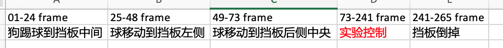
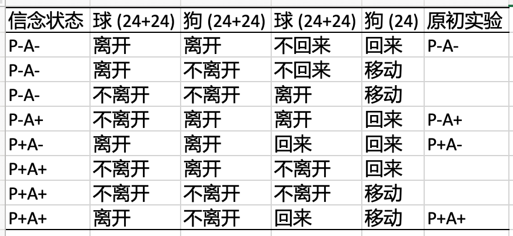

# 2021-05-21 号, 实验设计

- 备注：每一个缓解的具体长度需要根据做出一个例子后的实际效果再做调整。

- 设计的实验流程及长度

- 具体的实验控制及其预期长度

- 球的第一次变化

    - 球“离开”条件，首先，球从挡板后移动到右侧挡板和屏幕边界的中间（24桢）；然后球从中间位置移出屏幕边界 (24桢)；
    - 球“不离开”条件，首先，球从挡板后移动到右侧挡板和屏幕边界的中间（24桢）；然后球从中间位置移回到挡板后面 (24桢)；

- 狗狗的第一次变化

    - 狗“离开”条件，首先，狗进行90度旋转（24桢）；然后，狗再进行90旋转并离开屏幕 (24桢)；
    - 狗"不离开"的条件，首先，狗进行90度旋转（24桢）；然后，狗再进行90度反向旋转，即狗狗返回到原初的状态 (24桢)；

- 球的第二次变化

    - 球“回来”条件，首先，球从屏幕边界移动到挡板右侧和屏幕边界的中间位置 (24桢)；然后，球从中间位置移动到挡板后面（24桢）；

    - 球“不回来”条件，首先，球从屏幕边界移动到挡板右侧和屏幕边界的中间位置 (24桢)；然后，球从中间位置重新移动到屏幕之外（24桢）；

- 狗的第二次变化

    - 狗“回来”条件，狗从屏幕左侧进入视野 (24桢)；

    - 狗“移动”条件，狗向左旋转45度，然后再反方向向右旋转45度（24桢），即回到原初位置。

- 附表：[实验控制附表](ITOM_Design.xlsx)

# 2021-04-27 号

- 需要改进

    - 物体稍微改大一点，与原实验一致。
    - “杜宾+车”，车与整体风格不一致，改为其他物体。

# 2021-04-19 需要改进

- 原初发表在Science上的文章：[文档链接](https://science.sciencemag.org/content/sci/suppl/2010/12/20/330.6012.1830.DC1/Kovacs_SOM.pdf)
他们有：8类 =  行为主体信念（有/无）X 被试信念（有/无）X  实际结果（有/无）。
每类条件有5个trial，所以共有 40 个 trial。

- 我们的实验更复杂，需要增加一个变量，即行为主体的类型：有生命/五生命箭头。
- 即我们的实验应该有 16 类 = 行为主体类型（箭头/动物）X 行为主体信念（有/无）X 被试信念（有/无）X  实际结果（有/无）
- 此时，如果每个条件下  10  个trial (trial数需要比原来实验稍多)，则共需要 16 X 10 = 160 个 trial。

- 此时每个trial大约14秒，所以总时长大约37分钟，每个被试完成实验大约需要一个小时。

视频剪辑是用3D建模软件(3D Max；blender等)生成的。这些视频都有18秒长。
一共做40个视频，十类动物+物体组合，每类四个条件。
 
首先，动物用爪子（人物用脚）顶住一个球，让球滚动到盒子后面，该过程持续5秒。
 
之后，有四种条件：
 
被试（participant）和动物（AGENT）都认为球存在在盒子后面(P+A+)：
球滚到盒子后面（0-5s），
球滚出场景（5-8秒），
然后第8秒开始从场景外返回，
在第11秒时完全返回到盒子后面，
12-13秒动物离开场景，
14-15秒动物（人物）回到现场，再次出现。
15-18秒挡板降落，持续3秒，视频结束。这个阶段球一直都在盒子后面。
 
被试和行为人都认为球不存在(P−A−)：
球滚到盒子后面（0-5s），
球滚出场景（5-8s），
8-11s然后返回到盒子后面，
11-12秒滚出场景。
12-13s动物（人物）离开。
14-15s返回现场。
15-18s挡板降落，持续3秒。

被试认为不在，动物（人物）认为在（P−A+）：
球从前面滚到盒子后面（0-5s），
5-8s：球仍然在盒子后面，其中6-8秒动物（人物）离开场景。
动物（人物）离开之后，8-10s球从盒子后面滚出去，10s-12s又滚回盒子后面，12-14s滚出盒子，离开场景。
然后14-15s动物（人物）回来。
15-18s挡板降落，持续3秒。
 
被试认为在，动物（人物）认为不在（P+A−）：
球从前面滚到盒子后面（0-5s），
5-8s从盒子后面滚出场景。
然后动物（人物）离开现场(8-10秒)。
在动物（人物）离开期间，球回到盒子后(11-14s)，
然后动物（人物）再次出现（14-15s）。
15-18s挡板降落，持续3秒。

 
十类动物（人物）+物体组合：（搭配可随意，选圆形物体比较好滚动。要是模型不好找可选其他代替，3D溜溜网、CG模型网、Blender上可找模型。）
 
1、 狗+球
2、 猫+小汽车
3、 小鹿+苹果
4、 狐狸+鸡蛋
5、 羊+西瓜
6、 小黄人+橘子
7、 海绵宝宝+猕猴桃
8、 加菲猫+西红柿
9、 鸭子+桃子
10、 鸡+石榴

# 目前效果

- P-A-

- P-A+

- P+A-

- P+A+

