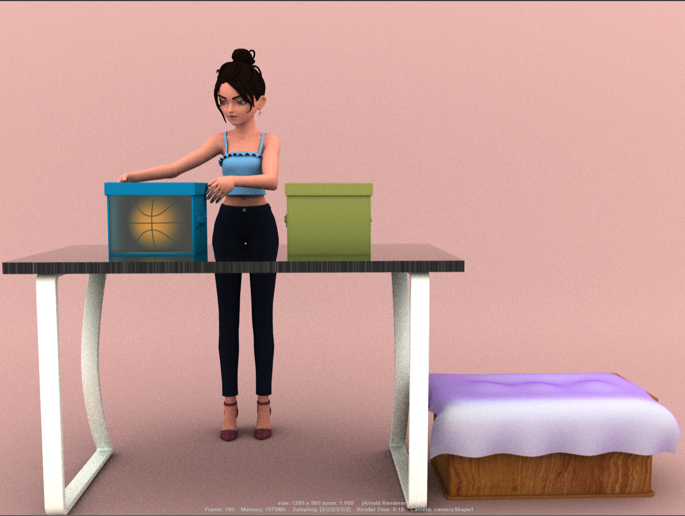
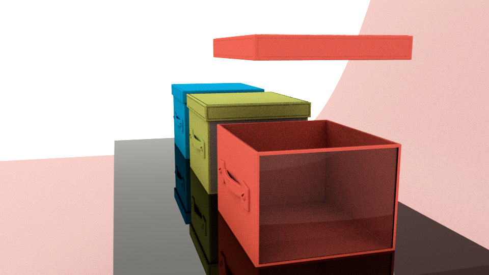
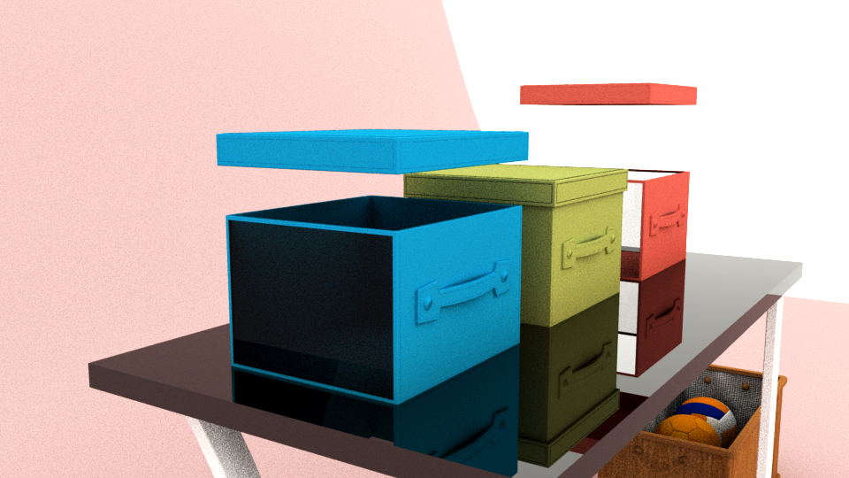

# 2021-05-11 版本

- 修改要求

    - 实验视频一，40s位置，人的位置稍微右移，使其位于两个箱子中间。
    - 50s-55s位置，时间进程上等毯子盖上筐子之后，物体运动的状态持续稍微久一点，此时行为主体继续盯着筐子，即强化下面的一个设定：让被试明白行为主体不知道筐子里的物体和凸起的对应关系。

- 动画效果

# 2021-04-22 版本

- 修改要求

    - 凸起修改的更为明显一些。
    - 每一次试验中，行为主体从左侧进入视野，行走至篮子附近时，应该有转身，面对篮子里的三个物体（此时物体不产生移动）；然后起身从右侧离开视野。行为主体从右侧视野淡出后，篮子中的两个物体从篮子移动到箱子里。之后，行为主体从右侧进入视野，转身，低头看，做了然状，然后行走至两个箱子中间。 

- 动画效果

# 2021-04-15 版本

1. 修改要求

- 为了让被试更清楚这三个箱子在不同的角度下看到的效果是不同的，实验开始前包含两个效果展示：
    - 三个空箱子的旋转效果
    - 三个箱子均有物体时的旋转效果展示。（ **需添加** ）
    - 展示上述两个过程时，行为主体也在场？（与大家讨论）
- 行为主体在场时，展示下面的过程（作为练习）
    - 行为主体站在筐子一侧；
    - 展示筐子里有三个物体时毯子的覆盖效果，行为主体掀开毯子，展示三个物体；
    - 三个物体中的两个移动至两个箱子里，毯子重新覆盖在筐子上，展示筐子里只有一个物体时的覆盖效果。（修改凸显这两种情况下覆盖效果的差异，以保证在实验过程中被试相信行为主体能够通过覆盖效果推测框子里只有一个物体，即另外两个物体已经分别装到了两个箱子里）
- 每一次试验程序
    - 行为主体从左侧进入视野，往右行走；
    - 行走至桌子上两个箱子的中间位置时，转身，下蹲（下蹲至行为主体的视线与箱子的侧面大体平行）；
    - 然后起身，转身，继续往右行走；
    - 行走至筐子位置时转身，下蹲。在行为主体的注视下，发生下列事件。此时有两种方案（暂定方案1）：
        - (1) 框子中应该有三个物体，且没有被覆盖；然后毯子覆盖在筐子上。即仅展示三个物体被覆盖后的效果。
       <!--- - (2) 箱子中没有物体且没有被覆盖，然后三个物体依次被放入筐子并盖上，即顺序展示一个物体、两个物体、和三个物体被覆盖后的效果。 --->
    - 行为主体从屏幕右侧走出视野。
    - 在行为主体离开视野后，少做停顿，筐子中的两个物体从筐子分别移动到两个箱子里。毯子盖上，只剩一个凸起。
    - 行为主体从右侧进入视野。
    - 行走至筐子时，转身下蹲做观察状，并转头望向两个箱子的位置。（此处希望让被试明白，行为主体知道筐子中三个物体中的两个移动到了两个箱子里，但是行为主体并不知道是哪两个）。
    - 行为主体起身，继续往左走，行走至两个箱子中间位置时，转身，下蹲至视线与箱子平行位置，头部左右转动；
    - 行为主体起身，稍作停顿，两手伸向其中一个箱子。视频结束。
- 被试的任务：屏幕出现三个物体，被试按键判断行为主体最喜欢哪一个。

2 现有版本效果

- 人物渲染

- 动画效果

# 2021-04-08 版本

- 人物渲染

- 动画效果

# 材料准备

1. 总的三维模型可以是一个简单的室内空间。模型最里侧可以是一面墙，墙前面站着一个人物主体。 主体前面是一个桌子。人物面对屏幕站在（或坐在）桌子旁边。主体面前桌子上摆着两个箱子。视频中主体会把手伸向两个箱子中的一个并打开。

2. 颜色为红绿蓝形状完全相同的三个箱子。上述模型中的箱子为其中两个。其中红色箱子有两个面是透明的，蓝色箱子有一个面是透明的，绿色箱子六个面都不透明。人只有通过透明面才能看到箱子里的物体是什么，否则只能猜。所以（1）当蓝色箱子的透明面对着屏幕时，被试能看到箱子里的东西，主体看不到；当蓝色箱子的透明面对着主体时，主体能看到，被试看不到。（2）当箱子是红色时被试和主体都能看到箱子里的物体。（3）当箱子时绿色时，被试和主体都看不到箱子里的物体。为了让被试直观的了解箱子的性质，模型中应该对每个箱子做三维旋转让被试有一个简单的直观的感觉，即在什么时候能够看到箱子里的东西。

3. 箱子中的物体应该是在每次试验中都发生变化的，箱子的颜色和左右位置也是发生变化的。
