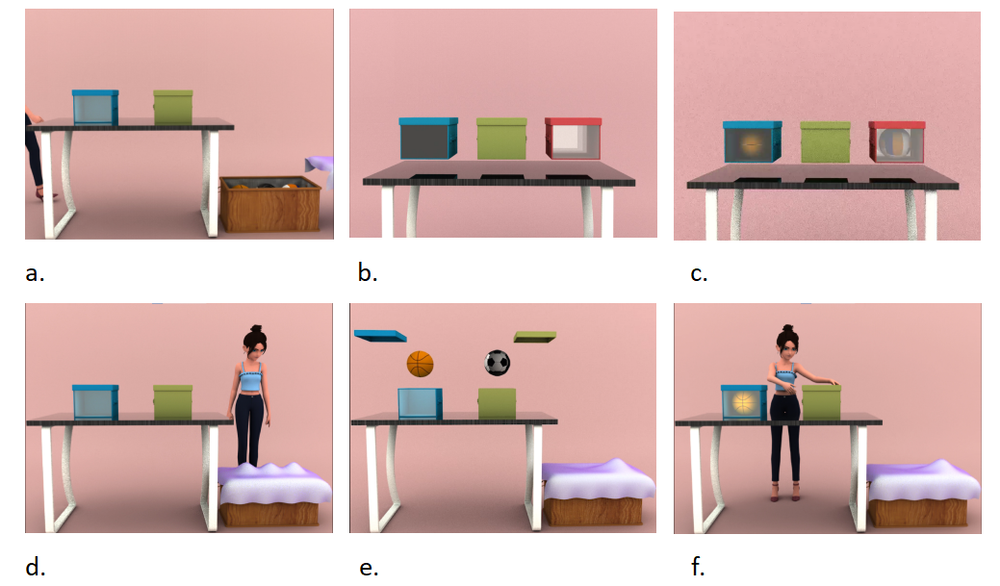

# 1.Introduction
Broadly speaking, negation “relates an expression e to another expression with a meaning that is in some way opposed to the meaning of e” (Horn and Wansing 2017). As described by Lawler (2010), cognitively, negation“involves some comparison between a real situation lacking some particular element and an imaginal situation that does not lack it.”
# 2.Experimental materials

We designed experimental materials in Autodesk Maya 2022, from building models to generating animations. Each animated movie has 730 frames, and our playback speed is 24 frames per second, so the total duration of each movie is 30.42 seconds. The scene includes a table and two boxes on the table, as well as a wooden basket next to the table.(Figure. 1a). For experimental purposes, we have designed three types of cube boxes(Figure. 1b): the six sides of the green box are opaque, that is, no objects can be seen in the box from any angle; One of the sides of the blue box is transparent, when this transparent side faces to the agent or subject, they can see whether there is an object in the box and what the object looks like through this side. However, since the agent and the participant are face to face, in a scene, the transparent side can only be seen by one of them;Two sides of the red box are transparent, and these two sides are facing each other, so the subject and the agent can see whether there are objects in the box and what the objects look like at the same time.The appearance of each type of box after being loaded into the object is shown in Figure. 1c. It is worth mentioning that the two boxes that appear on the table each time may be the same type or two different types. Each box has a top lid, which can be opened, and objects can be put into the box after the lid is opened.

There will be 3 objects in each movie, which means that the 3 objects are a set. Initially they are placed in a wooden basket, and then two of the three will go into two boxes on the table respectively. In the experiment, we collected a total of 42 objects, and randomly numbered the objects (1-42). Every 3 numbered adjacent objects were used as a set, resulting in a total of 42 sets. The number represents our initial assumption that the agent’s preference of each object. The smaller the number of the object, the higher the agent's preference for it. For example, for the 3 objects numbered 1, 2, and 3, we default that the agent prefers object 1 the most, secondly prefers object 2, and least prefers object 3.

At the beginning of the movie, the agent enters the scene from the left side of the screen, stops when she walks from left to right to the middle behind the table, and then turns to face the participants. Immediately afterwards, the agent squatted until his sight was on the same level as the two boxes on the desktop, and turned his head to the left and right to observe the two boxes, both boxes were continuously observed for 1 second. After the observation, the agent got up and continued to move to the right.When the agent walks to the middle position behind the wooden basket, he lowers his head and squats to observe the objects in the wooden basket. During the agent's observation, the three objects in the basket will constantly exchange positions. At the same time, the shielding cloth on the right side of the wooden basket gradually moves to the left until it completely covers the opening of the wooden basket. During the process that the masking cloth gradually covers the wooden basket, the three objects continue to exchange positions. During this period, the agent can see that there are 3 bulges on the masking cloth that exchange positions. Then, the agent got up and continued to move to the right until she left the scene, at the same time, the 3 bulges on the shielding cloth gradually stabilized at a certain position(Figure. 1d), indicating that the three objects in the basket still exist, but they have stopped exchanging positions.

After the agent completely faded out of the scene, the shielding cloth of the wooden basket was opened, revealing the 3 objects in the basket again. At the same time, the lids of the two boxes on the table were also opened, two of the three objects moved from the wooden basket to the two boxes respectively(Figure. 1e). Then the wooden baskets and boxes are covered again. At this time, there is only one bulge on the shielding cloth, which means that there is only one object in the wooden basket. After that, the agent returned to the scene from the right side of the screen. When the agent reached the middle position behind the wooden basket, she stopped and turned and looked down at the basket. At this time, the agent saw only one bulge on the shielding cloth, then she turned her head to the table, looked at the two boxes on the table, and put one hand on her chin in a thinking state, indicating that she already knew that two objects were transferred to the two boxes. After understanding all of this, the agent continued to move to the left, stopped again when she reached the middle position behind the table and turned around. In order to see the objects in the basket clearly, the agent squatted again until the line of sight was on the same level as the boxes, and observed separately two boxes on the left and right. If the side facing the agent's box is transparent, then she can see the objects in the box, if it is opaque, she can't see it. However, no matter whether the agent can see the objects in the box or not, she will get up again and stretch her hand to one of the boxes(Figure. 1f), the movie ends here.

# 3.Produce
We tested the scoring results of the participants on the three objects in the "Preference" task through a 7-degree scale (1 means "least preference", 7 means "most preference"). During the experiment, the participants sat in front of the computer screen and adjusted to a comfortable posture that is convenient for using the mouse. Before the experiment starts, the screen will present instructions to inform the participants what they are about to see and the tasks they need to perform. After the participants have read the instruction and fully understood, they can press the “space bar” to enter the experiment program at any time.

In order for the participants to better understand the experiment process, we prepared a pre-familiar video. In this video, the boxes appearing in the experiment will be shown (the green box is opaque on six sides, and one side of the blue box is transparent，the red box has two face-to-face faces that are transparent), the appearance of the box after loading the object (the object can not be seen on the six sides of the green box, the object loaded into the box can be seen through the transparent surface of the blue box, and the loaded object can be seen through the two transparent surfaces of the red box). In the pre-familiar video, the participants can also see the agent’s behavior in the formal experiment and the final display pictures that determine the agent’s preference for each object. The experimenter will demonstrate the operation method and allow the subject to operate.The pre-familiar process stopped until the participants fully understood the experimental process and test tasks.

# 4.Experiment design
We use PsychoPy v3.0 to design the experimental program. At the beginning of the program, the prompt "picture is about to be displayed" is presented and lasts for 1 second, and then a picture containing 3 objects will appear, which will appear in the video to be played. The purpose is to familiarize the participants with the objects in this trial. After the picture display is over, the next prompt "video is about to be played" is presented, which also lasts for 1 second to remind participants to watch the movie. It should be noted that although the total length of our video is 30.42 seconds, in order to ensure that the movie can be played completely and to give participants a certain reaction time, the video will freeze at the last frame after the video is played, and it will last until the end of 34 seconds. In other words, the total duration of playing the video is 34 seconds. After the video is played, it enters the stage of judging preferences. At this time, a picture that is the same as the display picture at the beginning of the program will appear on the screen. The difference is that at the top of the picture there is a line of prompts "Please judge the preference of the girl in the video for each object", and at the bottom of the picture there are three 7-degree scales, which are located directly below the three objects. At this time, participants can use the mouse to determine the agent’s preference for each object on the three 7-degree scales. The scale marks from top to bottom indicate that the preference is gradually increasing. In other words, the closer the tick mark is to the object, the higher the preference for this object. Place the cursor on the scale bar, every time the participants click the right mouse button, a small red dot will appear at the corresponding position of the scale bar. Participants can use the mouse to drag the small red dot at any time to adjust its position to determine the degree of preference they think the agent has for each object. Until the participants determine the 3 most suitable positions they think are the most suitable, they can press the space bar to enter the next trial.

## 4.1 Experiment 1:
The purpose of experiment 1 is to determine whether the participants have negative concepts while ignoring perspective selection. Therefore, in this experiment, the scene seen by the participants and the agent was the same. In order to ensure that the scene seen by the participants and the agent is consistent, we choose these three combinations of boxes: red + red, green + green, red + green. For each combination of boxes, we counterbalance the right and left of agent selection，so there are a total of 6 different types of movies, 3(Three box combination types) × 2(Agent choose left or right). There are 42 movies of each type (consisting of box combinations and 42 sets), in experiment 1, we produced a total of 256 movies, each participant watched 84 movies, 14 of each of the 6 types of movies. 

Under the condition of red + red, the objects put into the box are 2 of the 3 objects with the smaller serial number. The agent always chooses the box with the smallest serial number, regardless of whether the box is on the left or on the right.For example, in the set of objects numbered 1, 2, and 3, two objects with serial numbers 1 and 2 enter two red boxes on the table respectively, and the agent always chooses the box containing the object number 1, whether it is on the left or the right.Although the participants did not know the serial numbers of the objects, however, the red box had two transparent sides, therefore, under the condition of red + red, both participants and agents can see the situation in the two red boxes. Under such conditions, The two different observation and selection orders of the agent will produce a variety of different negative understanding processes and results. First, the agent looks to the left (right) side box first, and then to the right (left) side box: (1) If the agent finally chooses the left box, it means that the object in the left box is not the agent's favorite(The act of looking at another box is interpreted as looking for a more preferred object),but less preference for objects in the box on the right. Under such conditions, the behavior of the agent may lead to two different negative concepts. First, the agent first looks at the box on the left (right) side, and then at the box on the right (left) side: (1) If the agent finally chooses the left box, it means that the object in the left box is not the agent's favorite (The act of looking at another box is interpreted as looking for more preferred objects), but even less favoring the objects in the right box. According to the negative process of “not A, not even B,” the conclusion is C. We predict that the final preference ranking result is: C>A>B, and it is consistent with our previous preset ranking. (2)However, if the participants think that the agent’s behavior is only to observe the two boxes separately, and has no other purpose, the participant’s negative process may be "not A, but the agent prefers B compared to A", then the agent can only be determined the degree of preference for B must be greater than the degree of preference for A, but the degree of preference for C by the agent is unknown. If the participant’s negation is exactly like this, the following results will appear: B>A>C; B>C>A; C>B>A. In other words, the preference order of the two objects in the two boxes is the same as our original preset, but the preference of the object still in the wooden basket cannot be determined. Second, if the agent first looks at the left (right) and then the right (left), and finally chooses the box on the right, the possible negation process: (1) "Not A, maybe B or C", that is, the behavior of the agent may be interpreted by the participant as that her least favorite is A (the one she looked at first), but the order of B and C cannot be determined. The negative results are: B>C>A; C>B>A. (2) "It's not A (the one looked at first), it's B (the one that was finally selected), not C", the negative results are: B>A>C; B>C>A. (3) "It's not A (the one you looked at first), it may be B or C", the negative results are: B>C>A; C>B>A. (4) "Not A (the one you looked at first), not even C, but B (the one you chose)", the negative result is: B>A>C. (5) "It's not B (the one you chose), let alone A (the one you looked at first), it's C", the negative result is: C>B>A. However, if the participants think that the agent’s behavior is only to observe the two boxes separately, and has no other purpose, the participant’s negative process may be "not A, but the agent prefers B compared to A", then the agent can only be determined the degree of preference for B must be greater than the degree of preference for A,but the degree of preference for C by the agent is unknown. The negative results are still these: B>A>C; B>C>A; C>B>A. Although it seems that red+red condition gives the most hints and the context information seems to be clearer, however, it is harder to understand the behavior of the agent. This also shows that, to a certain extent, until more vague information, the negation processing becomes more complicated and difficult. Negative concept processing is a rather complicated process.

Under the condition of green + green, the objects put into the box are the 2 with the larger serial number among the 3 objects, and the agent always chooses the box with the smaller serial number, regardless of whether the box is on the left or on the right.Under the condition of green + green, the objects put into the box are 2 of the 3 objects with the larger serial number. The agent always chooses the box with the smaller serial number, regardless of whether the box is on the left or the right. For example, in the set of objects numbered 1, 2, and 3, the two objects numbered 2 and 3 enter the two green boxes on the table respectively, and the agent always chooses the box where the object numbered 2 is located. But the participants didn’t know the number of the object, in their opinion, because under the condition of green + green, the agent could not see whether there was an object in the box or did not know which object was in the box she chose. For the agent, the choice under this condition is random, or it depends on luck. Since no prompt information was provided about the agent’s preference for a certain object, the participants could only determine the agent’s preference for these three objects based on their intuition.

Under the condition of red + green, the participants and the agent can see the objects in the red box, and neither of them can see the objects in the green box. In the experimental videos, the agent always chooses the green box. In other words, although the agent saw the object in the red box, she did not choose the red box, indicating that the agent's least favorite object was the one in the red box. However, it is still unclear how the agent prefers the other two objects. The negative process is "not A, maybe B or C". The negative results are: B>C>A; C>B>A. However, whether the agent looks at the green box or the red box before making a choice may result in two different negative processes.First of all, if the agent looks at the red box first, and then at the green box, this behavior may be understood by the participants as “the object in the red box is not the agent’s favorite, so the agent will look for her favorite object again. Although the agent cannot see what the object in the green box is, the agent still chooses the green box. It can be inferred that the object in the red box is the agent's least favorite." Second, if the agent first looks at the green box, then at the red box, and finally chooses the green box, this behavior may be understood by the participants as "Because the green box is opaque, the agent looks at the red box in order to find more clues to determine where her favorite object is, but after seeing the object in the red box, she finds that this object is the one she least favorite. Therefore, no matter what the object in the green box is, the agent’s preference for the objects in the green box is higher than the preference for the objects in the red box.”Regardless of the negation process of the participants, they will come to the same conclusion-the agent least prefers the object in the red box.Another possibility is that the participants did not interpret the agent’s behavior of looking at the two boxes separately. Their negative understanding process may be, "The agent did not choose the object she saw, but chose another one, indicating that the agent The least favorite is the object in the red box", the negative result is still "not A, but B or C".No matter what the negation process is, the negation results are consistent when the background information is relatively clear.
